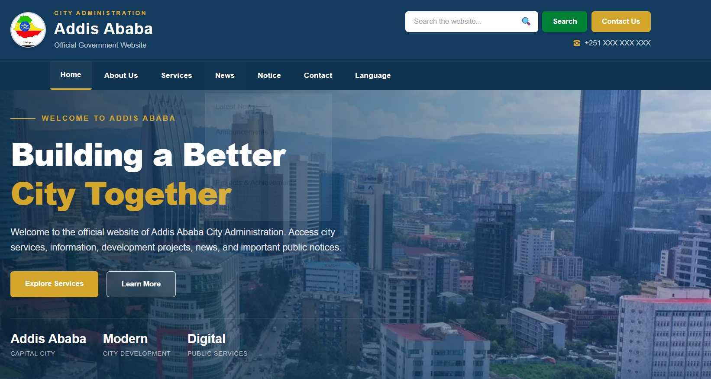
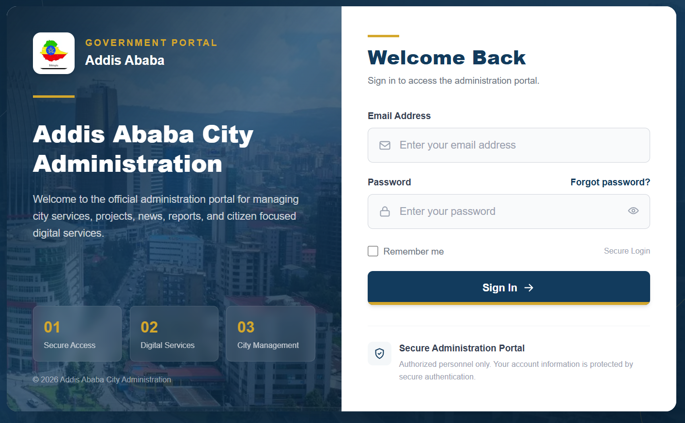
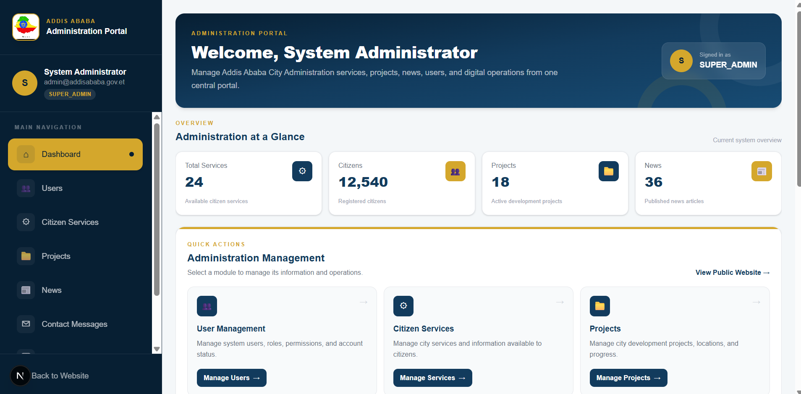
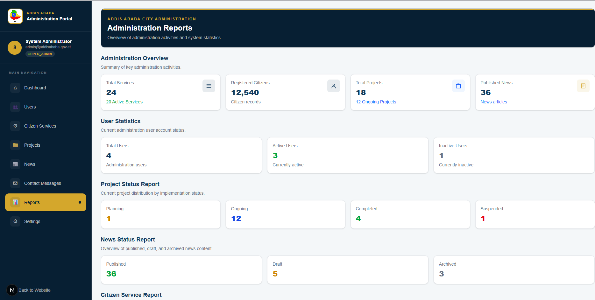
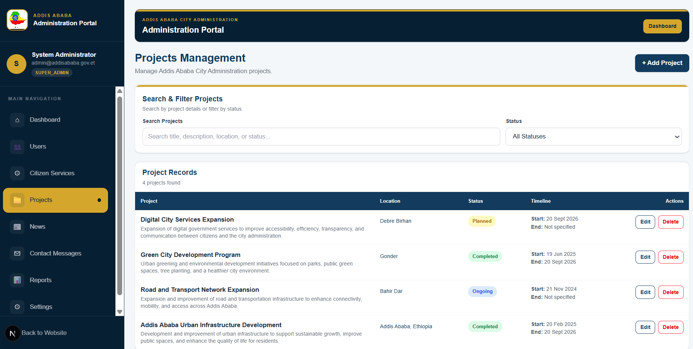
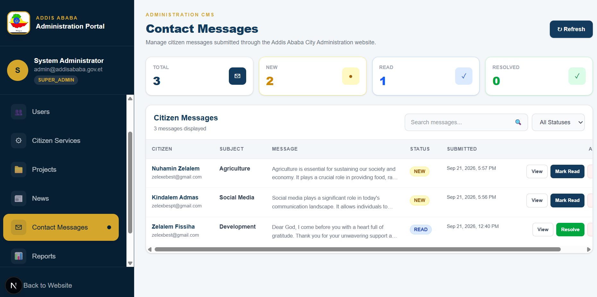

# 👋 Hi, I'm Zelalem Fissiha

### Full Stack Developer | Software Business Analyst | AI Engineer | Data Analyst | University Lecturer

I am a technology professional focused on building modern software systems, analyzing business requirements, developing data-driven solutions, and applying Artificial Intelligence to practical problems.

My professional interests bring together Software Engineering, Business Analysis, Artificial Intelligence, Data Analytics, Teaching, and Research. I enjoy transforming real-world challenges into practical digital solutions that improve processes, support informed decision-making, and create meaningful impact.

## 🚀 What I Do

• Full Stack Web Development
• Software Requirements Analysis
• Software Requirements Specification
• Business Process Analysis
• Artificial Intelligence and Machine Learning
• Data Analysis and Visualization
• Database Design and Development
• Academic Teaching and Research
• Digital Transformation Solutions

## ⭐ Featured Project

### Addis Ababa City Administration Digital Platform

A modern full stack web platform designed to support digital public services, administrative functionality, citizen engagement, project information, reporting, and organizational management.

### Key Features

• Modern public administration website
• Responsive user interface
• Authentication and login
• Administrative dashboard
• Project management interface
• Reports and data presentation
• Contact and citizen support functionality
• User management
• System settings
• Structured navigation and service sections
• Modern responsive design

### Technology Stack

• Next.js
• React
• TypeScript
• Tailwind CSS
• Node.js
• PostgreSQL
• Prisma
• REST API concepts
• Git and GitHub

## 🖥️ Project Showcase

### Addis Ababa City Administration Home Page

  

### Authentication and Administration

  
  

### Reports and Project Management

  
  

### Citizen Contact Page

  

## 💻 Software Development

I develop practical web based systems with a focus on usability, maintainability, responsive design, database integration, and real world organizational requirements.

My development interests include:
• Full stack web applications
• Administrative information systems
• Business process automation
• Database driven applications
• Government and institutional digital platforms
• API based applications
• Responsive web interfaces

## 🤖 Artificial Intelligence and Machine Learning

My interests in AI and machine learning focus on applying intelligent techniques to practical problems.
Areas of interest include:

• Machine Learning
• Deep Learning
• Predictive Analytics
• Educational Data Mining
• AI for Education
• AI for Public Service Delivery
• Intelligent Systems
• Data Governance
• Algorithm Optimization
• Software Defect Prediction
• Network Optimization

## 📊 Data Analytics

My interests in AI and machine learning focus on applying intelligent techniques to practical problems.
Areas of interest include:
I work with data-driven approaches for analysis, prediction, visualization, and decision support.

Areas

• Data preprocessing
• Exploratory data analysis
• Predictive analytics
• Data visualization
• Educational data analysis
• Machine learning-based prediction
• Statistical analysis
• Decision support systems

Technologies

• Python
• Pandas
• NumPy
• Matplotlib
• Seaborn
• Scikit-learn
• TensorFlow
• PyTorch
• XGBoost

## 📊 Software Business Analysis

I am interested in connecting business needs with practical technology solutions.
My business analysis interests include:

• Requirements gathering
• Requirements analysis
• Software Requirements Specification
• Business process modeling
• Process analysis
• Stakeholder analysis
• Functional and non-functional requirements
• System analysis
• Use case development
• Solution evaluation
My development and academic experience allow me to understand both business requirements and technical implementation.

## 🎓Research and Publications

##Optimization of LEACH Protocol in Wireless Sensor Network Using Machine Learning

Zelalem Fissiha Demssie and colleagues, 2022.

Published in Computational Intelligence and Neuroscience.

Research focus:

• Wireless Sensor Networks
• Machine Learning
• Network Optimization
• Intelligent Systems

Software Defect Prediction

Research work focused on developing a software defect prediction model using filter-based feature selection and Support Vector Machine algorithms for highly class-imbalanced software datasets.

Research areas include:

• Software Quality
• Machine Learning
• Support Vector Machines
• Feature Selection
• Class Imbalance
• Predictive Modeling

## 📚 Teaching and Academic Contributions

#My academic work combines teaching, research, curriculum development, student supervision, and practical technology development.

Curriculum Development

• Information Systems Curriculum Development Team Leader at Ethiopian Public Service University
• Software Engineering and Intelligent Systems Curriculum Development Leader
• Computer Science Curriculum Review Team Leader at Ambo University

#Academic Quality and Leadership

• Quality Assurance and Academic Auditing
• National Exit Examination Task Force Team Leader
• Final Year Industrial Project Advisor
• Course Module Development

## 🛠️ Technology Stack

### Programming and Development

### Database and Backend

### Data and AI

### Tools

## 📚 Education
### MSc in Project Management
Florida University of Southeast, USA
2025 to 2026
GPA: 3.9 / 4.00
Currently ongoing, expected completion in 2026.

### MSc in Software Engineering
Bahir Dar University, Bahir Dar Institute of Technology
2019 to 2020
GPA: 3.79 / 4.00
Thesis: Developing a Class Imbalance Software Defect Prediction Model Using SVM and Machine Learning Algorithms

### BSc in Computer Science
Bachelor of Science in Computer Science
2012 to 2016
GPA: 3.76 / 4.00
Graduation project: Web-Based Drug Store Management System for Ethiopian Red Cross Pharmacy Using PHP and JavaScript.
Project result: A+

## 🚀 Community Service

Machine Learning-Based Student Academic Performance Prediction System Lead Developer, 2023

Developed a machine learning-based system using academic data to identify performance factors and support data-driven academic advising and early intervention.

Software Digital Literacy and ICT Integration Training Project Coordinator, 2024

Designed and coordinated a university-led digital literacy training program supporting teachers in developing digital competencies and integrating ICT into teaching and learning.

Integrated Lecture Lab Framework Lead Developer, 2025

Worked on a framework focused on enhancing practical programming skills through technology and Machine Learning approaches.

## Digital Literacy Training  

Community Service Trainer

Provided practical training on fundamental computer skills to staff of the Ambo City Administration and Housing Office.

🏆 Awards and Professional Development
Best Algorithm Design Award

Awarded first place during the second Annual Programming Week at Dire Dawa University for designing an algorithm for a Bank Queuing System.

Udacity Professional Training

• Artificial Intelligence Fundamentals
• Programming Fundamentals
• Data Analysis Fundamentals
• Android Developer Fundamental

## Professinal Development Training  

• E Learning and ICT Integration in Higher Education
• Teaching Online with Open edX
• Open edX Studio Development
• Project Planning, Analysis, and Monitoring
• Higher Education Pedagogical Training
• Peace Corps USA Ethiopia Virtual Service English Program

## 🎯 Professional Interests
• Full Stack Software Development
• Software Business Analysis
• Artificial Intelligence
• Data Science
• Machine Learning
• Digital Transformation
• Information Systems
• Software Project Management
• Technology Education and Research

## 🔭 Current Focus

Currently focusing on building practical software systems that combine:

**Business Requirements + Software Engineering + Data + Artificial Intelligence**

I am particularly interested in developing technology solutions that improve organizational processes, information management, decision making, and digital service delivery.

## 📂 Project Repository

You can explore the complete Addis Ababa City Administration project through my GitHub repositories.

## 🤝 Let's Connect

I am open to opportunities involving:

• Software Development
• Business Analysis
• Data Analysis
• Artificial Intelligence
• Research Collaboration
• Technology Projects
• Academic Collaboration

Thank you for visiting my GitHub profile.

**Let's build meaningful technology solutions together. 🚀**
